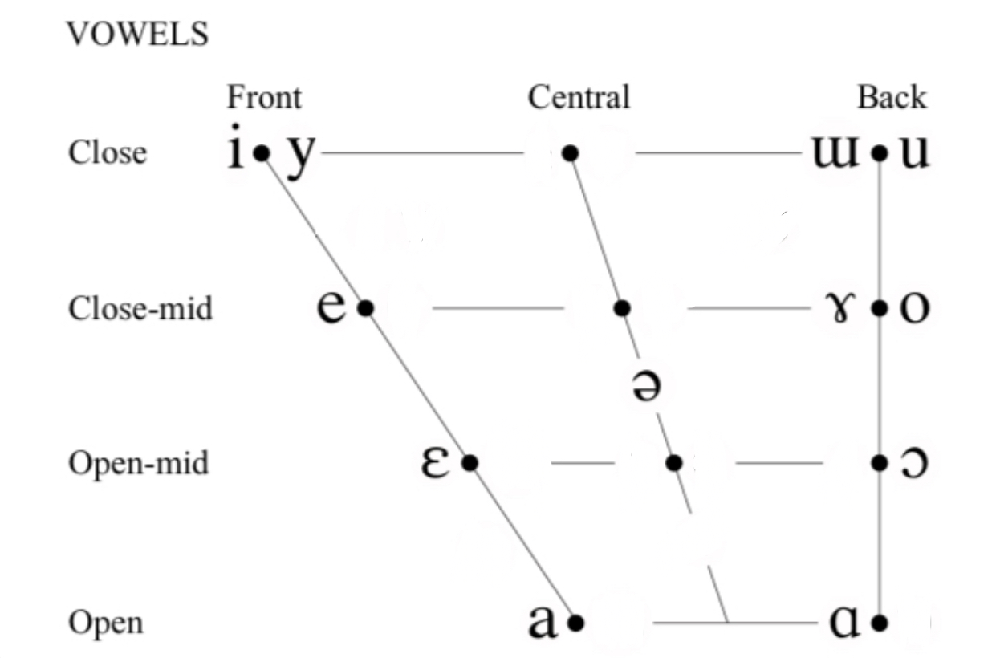

# rime-dran-roq-sreq-wu

[中文版本](./README-cn.md)
Romanization project of Wu Chinese, Changshu dialect

# Introduction

Changshunese, also known as the Changshu dialect, is a variety of Sinitic languages spoken in the city of Changshu in Jiangsu Province, China. Changshunese is closely related to Suzhounese, also a variety of Wu Chinese. Chanshunese has 33 initial consonants, 39 vowel finals, and 8 tones, which is preserved in the most complete form among dialects of Wu Chinese.

Due to the additional retroflex consonants and the distinction between dental and palatal affricates (尖团), other romanization proposals do not work with Changshunese, not to mention the drastic differences in vocabulary, grammar and vowel qualities, even compared with Suzhounese.

## Consonants

|           |           | Labial | Dental | Retroflex | Palatal | Velar | Glotta |
| :-------: | :-------: | :----: | :----: | :-------: | :-----: | :---: | :----: |
|   Nasal   |           |   m    |   n    |           |    ɲ    |   ŋ   |        |
|  Plosive  |  tenuis   |   p    |   t    |           |         |   k   |   ʔ    |
|           | aspirated |   pʰ   |   tʰ   |           |         |  kʰ   |        |
|           |  voiced   |   b    |   d    |           |         |   g   |        |
| Affricate |  tenuis   |        |   ts   |    ʈʂ     |   tɕ    |       |        |
|           | aspirated |        |  tsʰ   |    ʈʂʰ    |   tɕʰ   |       |        |
|           |  voiced   |        |   dz   |    ɖʐ     |   dʑ    |       |        |
| Fricative | voiceless |   f    |   s    |     ʂ     |    ɕ    |       |   h    |
|           |  voiced   |   v    |   z    |     ʐ     |         |       |   h    |
|  Lateral  |           |        |   l    |           |         |       |        |

## Vowels

## Romanization

| 全清    | 次清     | 浊       | 鼻      | 清擦    | 浊擦    |
| :------ | :------- | :------- | :------ | :------ | :------ |
| p 杯边  | ph 批坡  | b 皮部   | m 梅棉  | f 方飞  | v 帆肥  |
| t 刀低  | th 讨天  | d 唐定   | n 脑难  |         | l 拉林  |
| ts 早将 | tsh 猜青 | dz 瑞齐  |         | s 山西  | z 柴前  |
| tr 主招 | trh 冲超 | drh 常直 |         | sr 书声 | r 床受  |
| tj 鸡居 | tjh 区牵 | dj 桥巨  | nj 女银 | x 许休  |         |
| k 刚广  | kh 看苦  | g 共狂   | ng 瓦软 | h 海昏  | gh 杭胡 |
| 0 哀威  |          |          |         |         |         |

|      |      |  i   | 词时 |  i   | 知树 |      |      |
| :--: | :--: | :--: | :--: | :--: | :--: | :--: | :--: |
|      |      |  i   | 非希 |  u   | 波瓜 |  i   | 雨举 |
|  a   | 牌抓 |  ia  | 佳借 |  ua  | 歪坏 |      |      |
|  o   | 包照 |  io  | 笑巧 |      |      |      |      |
|  ei  | 梅够 |  ie  | 田线 | uei  | 规围 |      |      |
|  e   | 菜山 |  ie  |  念  |  ue  | 关弯 |      |      |
|  ee  | 盘钻 | iee  | 县捐 | uee  | 官碗 |      |      |
|  eo  | 土手 | ieo  | 刘丘 |      |      |      |      |
|  an  | 朋生 | ian  | 抢乡 | uan  |  横  |      |      |
|  an  | 钢仓 | ian  | 江腔 | uan  | 黄广 |      |      |
|  en  | 本胜 |  in  | 亲庆 | uәn  | 温坤 |      |      |
| ong  | 风虫 | iong | 军兄 |      |      |      |      |
|  aq  | 百揷 | iaq  | 约略 | uaq  | 滑挖 |      |      |
|  eq  | 特革 |  iq  | 笔及 |      |      |      |      |
|  o?  | 八独 | io?  | 曲肉 | uo?  | 割屋 |      |      |
|  o?  | 木各 | io?  | 觉学 | uo?  | 扩忽 |      |      |
|  er  | 而尔 |  m   | 亩姆 |  n   | 五午 |      |      |

